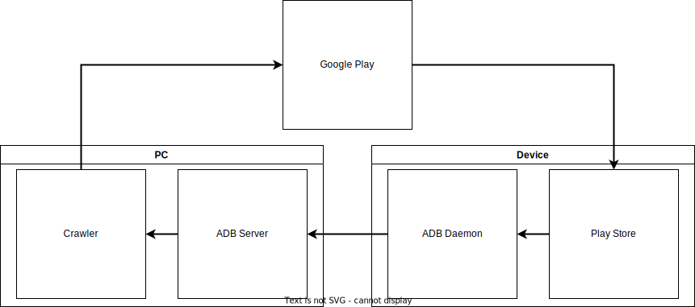

The flow of **APKcrawler** is simple as below.

1. `Crawler` keeps asking `Google Play` to install a new APK on an Android device.
2. Then `Google Play` sends a response to the device for installation.
3. `Play Store` in Android installs the corresponding APK in response.
4. When the requested APK is installed, the `ADB Daemon` packs and sends it to the `ADB Server`.
5. `Crawler` collects all APKs received by `ADB Server`.
6. Repeat 1-5.
